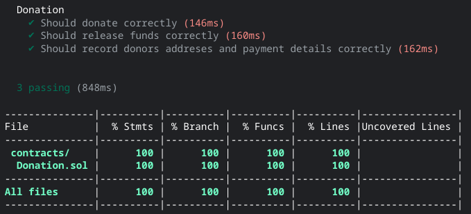

# donation

- A `hadhat` 100% unit covered tested donation contract.
- A contract that allows address that deployed it to receive funds and then withdraw them back to the same address with full visibility received funds

## hardhat tasks:

- `npm install hardhat`
- `npx hardhat coverage`

## coverage

 

</a>

 
